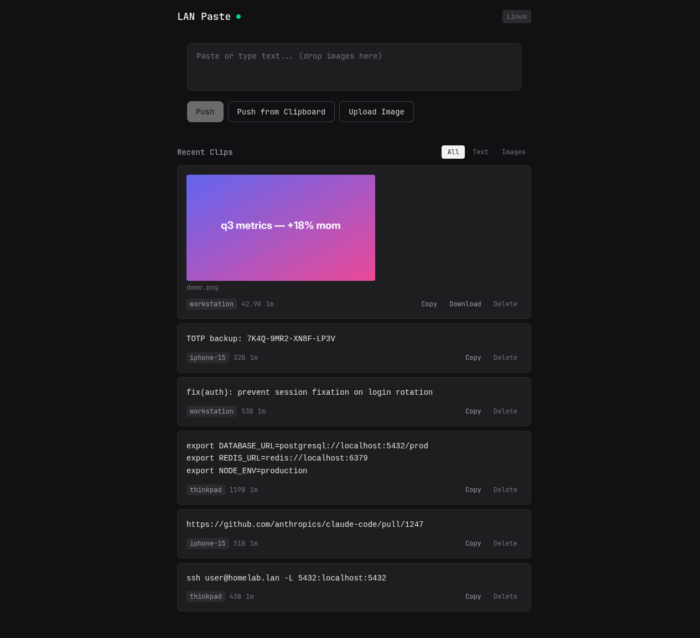

# LAN Paste

Cross-platform clipboard sharing over Tailscale/LAN. Copy on any device, paste on any other — like Universal Clipboard, but for Linux, Windows, iOS, and anything with a browser.



## How it works

A central server on your homelab stores clips (text + images). Devices push and pull via REST API, with WebSocket for real-time sync.

- **Linux desktop**: Background daemon auto-syncs clipboard bidirectionally
- **iOS/iPad**: PWA web app + iOS Shortcuts for quick push/pull
- **Windows**: Web UI + CLI
- **Any device**: Open the web UI in a browser

## Quick Start

### 1. Install & build

```bash
git clone https://github.com/your-user/lan-paste.git
cd lan-paste
yarn
yarn workspace @lan-paste/shared build
yarn workspace @lan-paste/web build
yarn workspace @lan-paste/server build
yarn workspace @lan-paste/cli build
```

### 2. Configure

```bash
cp .env.example .env
# Edit .env if needed (defaults work for local dev)
```

### 3. Run the server

```bash
yarn workspace @lan-paste/server start
# → http://0.0.0.0:3456
```

Open `http://<your-tailscale-ip>:3456` on any device to use the web UI.

### 4. Use the CLI

```bash
# Configure
lan-paste config init

# Push text
echo "hello" | lan-paste push
lan-paste push "some text"
lan-paste push -c              # from clipboard

# Push images
lan-paste push -f screenshot.png
lan-paste push -ci             # clipboard image

# Pull
lan-paste pull                 # to stdout
lan-paste pull -c              # to clipboard
lan-paste pull -o image.png    # save image

# History
lan-paste history
lan-paste history -n 10 --type text

# Auto-sync daemon
lan-paste watch                # bidirectional clipboard sync
lan-paste watch --push-only
lan-paste watch --verbose
```

### 5. Run as services (optional)

```bash
# Server (homelab)
sudo cp deploy/lan-paste-server.service /etc/systemd/system/
sudo systemctl enable --now lan-paste-server

# Clipboard daemon (desktop)
cp deploy/lan-paste-watch.service ~/.config/systemd/user/
systemctl --user enable --now lan-paste-watch
```

## iOS Setup

1. Open `http://<server-ip>:3456` on your iPhone/iPad
2. Tap Share > "Add to Home Screen" for PWA
3. Set up iOS Shortcuts for quick push/pull — see [docs/ios-shortcuts.md](docs/ios-shortcuts.md)

## Development

```bash
# Server with auto-reload
yarn dev

# Web UI with HMR (proxies API to server)
yarn dev:web

# CLI during dev
yarn workspace @lan-paste/cli dev push "test"
```

## Configuration

### Server (.env)

| Variable | Default | Description |
|----------|---------|-------------|
| `LAN_PASTE_PORT` | `3456` | Server port |
| `LAN_PASTE_HOST` | `0.0.0.0` | Bind address |
| `LAN_PASTE_DB_PATH` | `./data/lan-paste.db` | SQLite database |
| `LAN_PASTE_STORAGE_DIR` | `./data/storage` | Image storage |
| `LAN_PASTE_RETENTION_DAYS` | `7` | Auto-delete clips after N days |
| `LAN_PASTE_API_KEY` | _(empty)_ | Optional auth token |

### CLI (~/.config/lan-paste/config.toml)

```toml
[server]
url = "http://100.64.0.1:3456"

[device]
id = "auto-generated"
name = "my-laptop"

[sync]
auto = true
images = true
```

## Security

- Tailscale provides WireGuard encryption + device authentication
- No HTTPS needed (Tailscale handles it)
- Optional API key for defense-in-depth
- Content size limits and MIME type validation

## License

MIT
