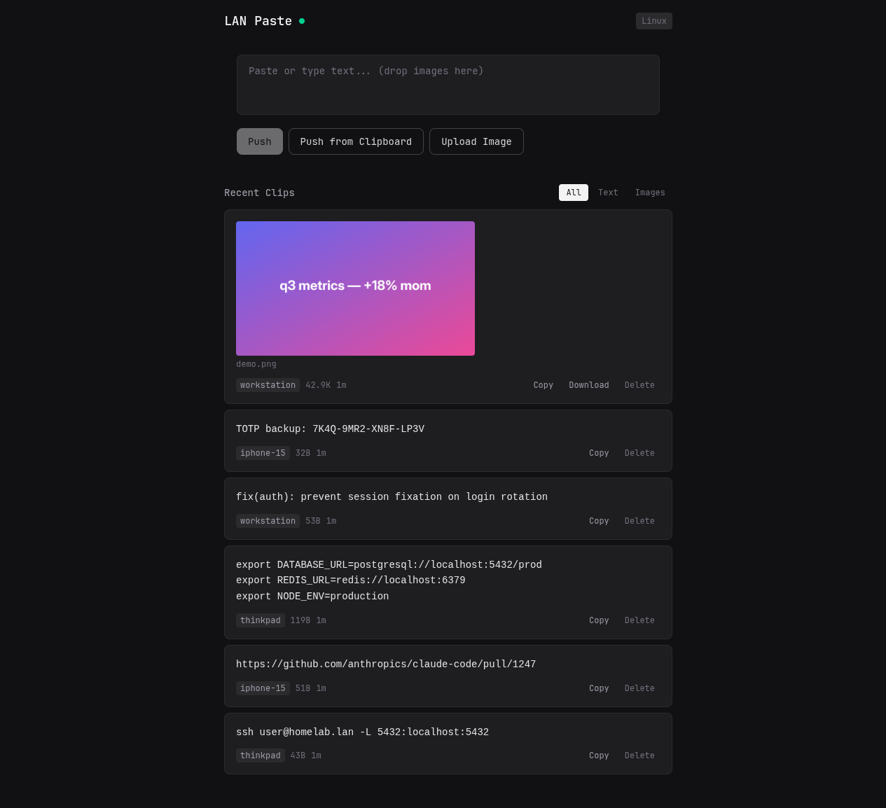

# LAN Paste

Cross-platform clipboard sharing over Tailscale/LAN. Copy on any device, paste on any other — like Universal Clipboard, but for Linux, Windows, iOS, and anything with a browser.



## How it works

A central server on your homelab stores clips (text, images and files). Devices push and pull via REST API, with WebSocket for real-time sync.

- **Linux / macOS / Windows desktop**: Background daemon auto-syncs the clipboard (text + images) bidirectionally
- **iOS/iPad/Android**: PWA web app (with Share Target) + iOS Shortcuts for quick push/pull
- **Any device**: Open the web UI in a browser

### Features

- Real-time sync over WebSocket; the daemon catches up on clips missed while offline
- Text, images and **any file type** (drag & drop, paste anywhere, share sheet)
- **Full-text search** of history (diacritic-insensitive), infinite scroll
- **Pin** clips to keep them forever; **expiring** and **one-time** (burn after read) clips
- **Send to a specific device**, device list with online status
- Optional **end-to-end encryption** with a shared passphrase — the server only stores ciphertext
- Syntax highlighting and clickable links for text clips

## Quick Start

### 1. Install & build

```bash
git clone https://github.com/your-user/lan-paste.git
cd lan-paste
yarn
yarn build      # shared → web → server → cli
```

Or run the server with Docker:

```bash
docker compose up -d        # data persisted in the lan-paste-data volume
```

### 2. Configure

```bash
cp .env.example .env
# Edit .env if needed (defaults work for local dev)
```

### 3. Run the server

```bash
yarn workspace @lan-paste/server start
# → http://0.0.0.0:3456
```

Open `http://<your-tailscale-ip>:3456` on any device to use the web UI.

### 4. Use the CLI

```bash
# Configure
lan-paste config init

# Push text
echo "hello" | lan-paste push
lan-paste push "some text"
lan-paste push -c              # from clipboard

# Push images & files
lan-paste push -f screenshot.png
lan-paste push -f report.pdf   # any file type
lan-paste push -ci             # clipboard image

# Push options
lan-paste push --expire 10m "temporary"      # 30s, 10m, 2h, 1d
lan-paste push --once "s3cr3t-password"      # one-time: deleted after first read
lan-paste push --to laptop "just for you"    # target a device (name or id)
lan-paste push --encrypt "e2e encrypted"     # or set encryption.enabled

# Pull
lan-paste pull                 # to stdout
lan-paste pull -c              # to clipboard
lan-paste pull -o image.png    # save image/file
lan-paste get <id>             # a specific clip (reveals one-time clips)

# History & management
lan-paste history
lan-paste history -n 10 --type text
lan-paste history --search "docker compose"
lan-paste history --pinned
lan-paste pin <id>  /  lan-paste unpin <id>
lan-paste delete <id> [<id>...]
lan-paste devices              # known devices + online status

# Auto-sync daemon
lan-paste watch                # bidirectional clipboard sync
lan-paste watch --push-only
lan-paste watch --verbose
```

### 5. Run as services (optional)

```bash
# Server (homelab)
sudo cp deploy/lan-paste-server.service /etc/systemd/system/
sudo systemctl enable --now lan-paste-server

# Clipboard daemon (desktop)
cp deploy/lan-paste-watch.service ~/.config/systemd/user/
systemctl --user enable --now lan-paste-watch
```

## iOS Setup

1. Open `http://<server-ip>:3456` on your iPhone/iPad
2. Tap Share > "Add to Home Screen" for PWA
3. Set up iOS Shortcuts for quick push/pull — see [docs/ios-shortcuts.md](docs/ios-shortcuts.md)

## Development

```bash
# Server with auto-reload
yarn dev

# Web UI with HMR (proxies API to server)
yarn dev:web

# CLI during dev
yarn workspace @lan-paste/cli dev push "test"

# Typecheck & tests (vitest; also run in CI)
yarn typecheck
yarn test
```

## Configuration

### Server (.env)

| Variable | Default | Description |
|----------|---------|-------------|
| `LAN_PASTE_PORT` | `3456` | Server port |
| `LAN_PASTE_HOST` | `0.0.0.0` | Bind address |
| `LAN_PASTE_DB_PATH` | `./data/lan-paste.db` | SQLite database (schema migrated automatically) |
| `LAN_PASTE_STORAGE_DIR` | `./data/storage` | Image/file storage |
| `LAN_PASTE_RETENTION_DAYS` | `7` | Auto-delete unpinned clips after N days (`0` = keep forever) |
| `LAN_PASTE_MAX_CLIP_SIZE_MB` | `10` | Max image/file upload size |
| `LAN_PASTE_LOG_LEVEL` | `info` | `debug`, `info`, `warn`, `error` |
| `LAN_PASTE_API_KEY` | _(empty)_ | Optional auth token (REST: `Authorization: Bearer`, WS/img: `?api_key=`) |
| `LAN_PASTE_WEB_DIR` | _(auto)_ | Path to the built web UI |

### CLI (~/.config/lan-paste/config.toml)

```toml
[server]
url = "http://100.64.0.1:3456"

[device]
id = "auto-generated"
name = "my-laptop"

[sync]
auto = true
images = true

[encryption]
enabled = false
passphrase = ""   # same passphrase on every device
```

Env overrides: `LAN_PASTE_SERVER_URL`, `LAN_PASTE_DEVICE_NAME`, `LAN_PASTE_API_KEY`, `LAN_PASTE_PASSPHRASE`, `LAN_PASTE_CONFIG` (config file path).

### Clipboard support (daemon)

| Platform | Text | Images | Tool |
|----------|------|--------|------|
| Linux (Wayland) | ✓ | ✓ | `wl-clipboard` |
| Linux (X11) | ✓ | ✓ | `xclip` (`xsel` text only) |
| macOS | ✓ | ✓ (PNG) | `pbcopy`/`pbpaste`, `osascript` |
| Windows | ✓ | ✓ (PNG) | PowerShell |

## API

| Method | Endpoint | Description |
|--------|----------|-------------|
| POST | `/api/clips` | Push text (JSON) or image/file (multipart field `file`). Options: `expires_in`, `burn_after_read`, `encrypted`, `target_device_id`, `platform` |
| GET | `/api/clips` | History: `limit`, `offset`, `before` (cursor), `type`, `device_id`, `q` (search), `pinned` |
| GET | `/api/clips/latest` | Latest clip; `?device_id=` excludes own clips and clips targeted elsewhere |
| GET | `/api/clips/:id` | Single clip |
| PATCH | `/api/clips/:id` | `{ "pinned": true }` |
| POST | `/api/clips/:id/reveal` | Read (and delete) a one-time text clip |
| GET | `/api/clips/:id/image` | Image, inline |
| GET | `/api/clips/:id/file` | Image/file download (one-time files are deleted after download) |
| DELETE | `/api/clips/:id` | Delete clip |
| GET | `/api/devices` | Devices with online status |
| GET | `/api/health` | Version, schema version, stats |
| WS | `/ws` | Events: `new_clip`, `clip_updated`, `clip_deleted`, `devices_changed` |

## Security

- Tailscale provides WireGuard encryption + device authentication
- Optional API key for defense-in-depth (REST + WebSocket)
- Optional end-to-end encryption (AES-256-GCM, key derived from a shared passphrase with PBKDF2-SHA256): the server never sees plaintext. Search does not cover encrypted clips.
- Uploaded files/images are served with a sandboxing CSP and `nosniff`, so e.g. SVG/HTML uploads can't run scripts
- Content size limits

**HTTPS note:** the PWA's offline mode, Share Target and the browser clipboard API need a secure context. Over plain `http://<tailscale-ip>` the web UI works, but those features are unavailable — use [`tailscale serve`](https://tailscale.com/kb/1312/serve) to get HTTPS on your tailnet.

## License

MIT
